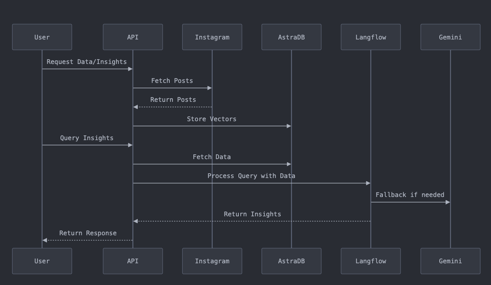
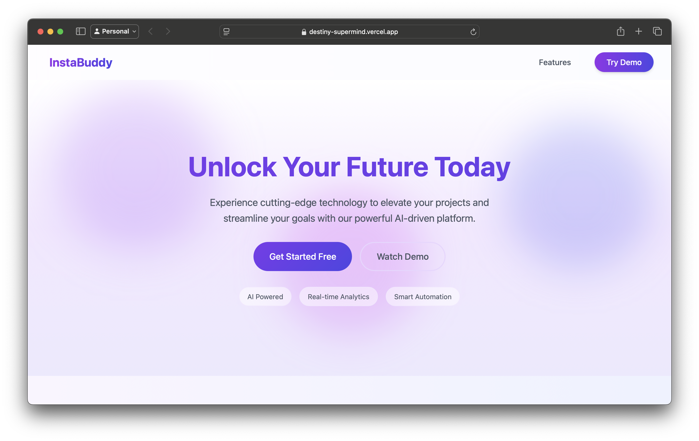
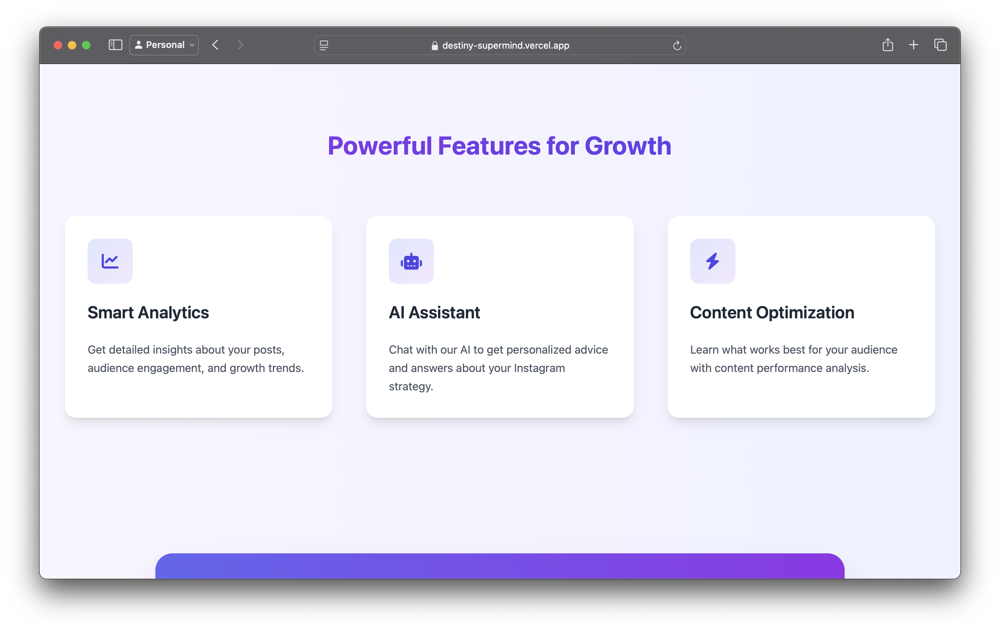
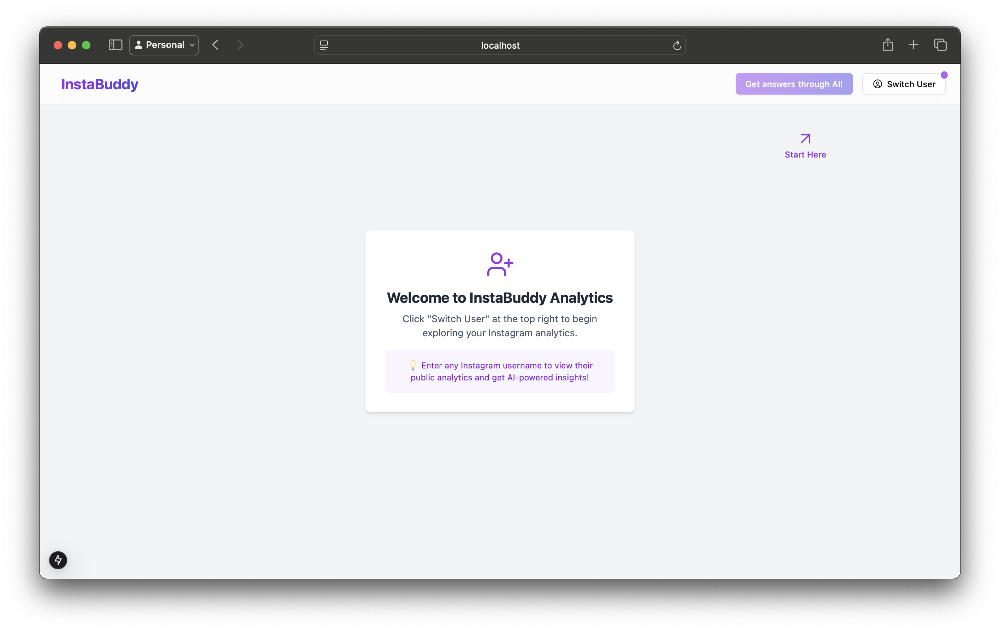
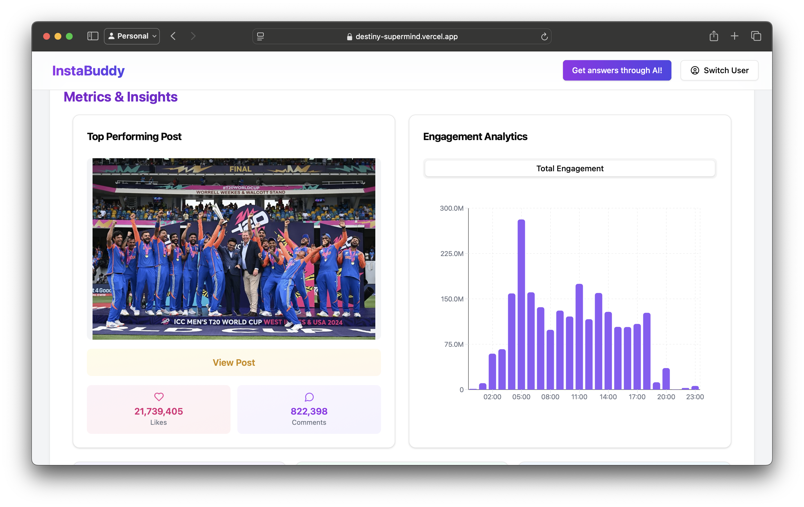
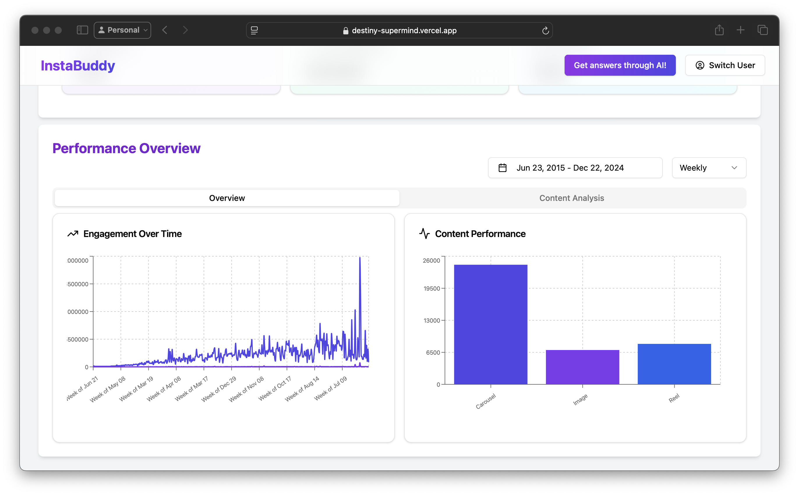
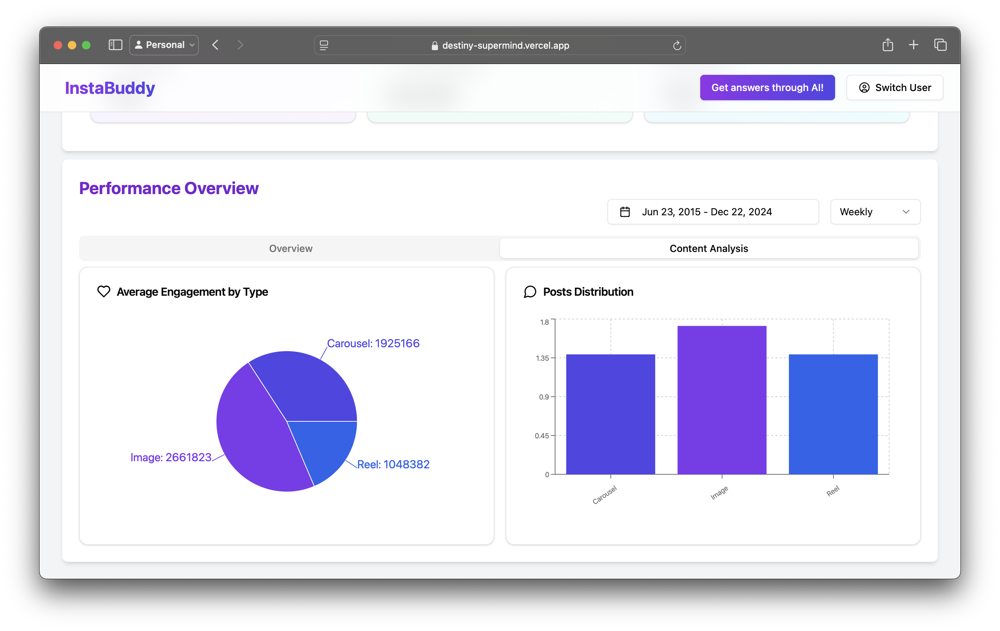
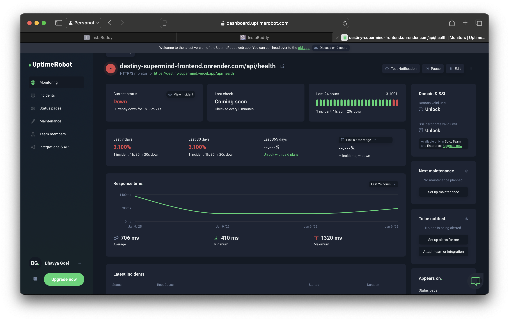

<h1 align="center"> 📸 Instabuddy  </h1>
Your AI-powered Instagram analytics and chatbot assistant! 🚀  

## 🌟 Features  

### 1. **Chatbot 🤖**  
The chatbot interacts with users by making API calls to **Langflow** and returning responses based on the pre-constructed Langflow pipelines.  

### 2. **AI Metrics & Analytics 📊**  
- Fetches Instagram data using the provided username from the frontend.  
- Stores data in **AstraDB** in vector format.  
- Performs calculations to extract insights.  
- Data is used to:  
  - Answer questions via the chatbot.  
  - Display analytics to the user.  

### 🩺 Health Endpoint  
The `/api/v1/health` endpoint checks the system's health, ensuring the application is up and running.  

---

## 🏗️ **Architecture Breakdown**  



### 1. **User Interaction 👥**  
* **Initiation:**  
  - The interaction begins with the **User (U)** sending a **Request Data/Insights** to the **API (A)**.  
  - This request could involve actions like:  
    - Requesting Instagram post data.  
    - Seeking user behavior insights.  
    - Asking questions about the data.  

### 2. **Data Acquisition 📥**  
* **Data Fetching:**  
  - The **API (A)** interacts with **Instagram (I)** to **Fetch Posts** relevant to the user's request.  
* **Data Storage:**  
  - The fetched posts are processed into **Vectors** by the **API (A)** and **Stored** in **AstraDB (D)**.  
  - Vector storage enables fast and efficient similarity searches and data retrieval.  

### 3. **Insight Generation 🔍**  
* **Query Processing:**  
  - When the **User (U)** submits a **Query Insights**, the **API (A)** retrieves the relevant **Data** from **AstraDB (D)**.  
* **Insight Generation:**  
  - The **API (A)** sends the data and query to a **Langflow (L)** pipeline, orchestrating NLP tasks.  
  - If challenges arise, Langflow uses **Gemini (G)** as a **Fallback** for:  
    - Complex query handling.  
    - Comprehensive insight generation.  
    - Understanding nuanced language.  
* **Response Generation:**  
  - Langflow processes the data and returns the requested **Insights** to the **API (A)**.  

### 4. **User Response 📤**  
* **Response Delivery:**  
  - The **API (A)** formats the generated insights into a user-friendly response.  
  - The response is delivered back to the **User (U)**.  

### ⚙️ **Key Components and Technologies**  
- **User (U):** End-users interacting with the system.  
- **API (A):** Orchestrates requests, services, and workflows.  
- **Instagram (I):** Social media platform for fetching data.  
- **AstraDB (D):** Vector database for efficient data storage and retrieval.  
- **Langflow (L):** Platform for building and deploying NLP pipelines.  
- **Gemini (G):** A robust LLM used for complex tasks and fallback processing.  

### ✨ **Benefits of this Architecture**  
- **Efficient Data Handling:** Vector storage enables rapid and scalable data searches.  
- **Flexibility:** Langflow supports diverse NLP pipelines adaptable to various use cases.  
- **Scalability:** Designed to handle large volumes of requests and data seamlessly.  
- **Enhanced Insights:** Gemini integration ensures high-quality responses, even for intricate queries.  

---

## 🔧 **Tech Stack**  
- **FastAPI**: Backend framework.  
- **AstraDB**: Vector database for Instagram data.  
- **Langflow**: NLP pipeline builder.  
- **Gemini Model**: Fallback for processing advanced queries.  
- **Asyncio**: Efficient asynchronous task management.  

---

## 📂 **API Endpoints**  

### 1. **Health Check** 🩺  
**`GET /api/v1/health`**  
- Verifies the system's health.  
- Returns a status and timestamp.  

### 2. **Fetch Data** 🗂️  
**`GET /api/v1/getData`**  
- Fetches Instagram posts for a given username.  
- Retrieves data from AstraDB or fetches live from Instagram if unavailable.  

**Query Parameters:**  
- `username` (str): Instagram username.  
- `count` (int): Number of posts to fetch (max 1000).  

### 3. **Get Insights** 🔍  
**`GET /api/v1/getInsights`**  
- Provides insights for a given query and username.  
- Utilizes Langflow or Gemini as a fallback.  

**Query Parameters:**  
- `username` (str): Instagram username.  
- `query` (str): Question or query for insights.  

---

## Screenshots 
### Landing Page:

### Features:


### Demo:


### AI Chatbot


### Metrics and Analytics:




### Health Monitoring:



## Langflow Model


## 🚀 **Getting Started**  

### Prerequisites  
- Python 3.9+  
- Install dependencies:  
  ```bash
  pip install -r requirements.txt
  ```  
- Node 
- Install dependencies:  
    ```bash
    npm i
    ```


### Run the Application  
1. Clone the repository:  
   ```bash
   git clone https://github.com/Kaustubh251002/destiny_supermind
   cd destiny_supermind/
   ```  

2. Set up the environment variables in a `.env` file:  
   - `ASTRADB_TOKEN`  
   - `DATASTAX_API_ENDPOINT`  
   - `GEMINI_PROMPT`  
   - `GEMINI_PROMPT_2`  

3. Start the frontend server:
   ```bash
   cd backend/
   npm run dev
   ```  


4. Start the backend server:  
   ```bash
   cd backend/
   uvicorn main:app --reload
   ```  
